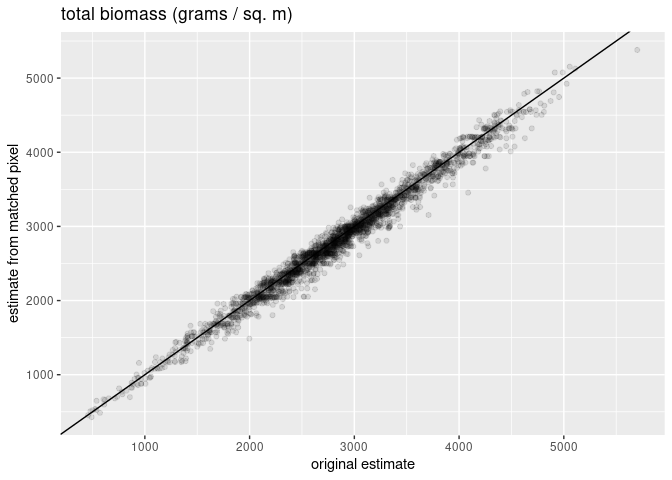
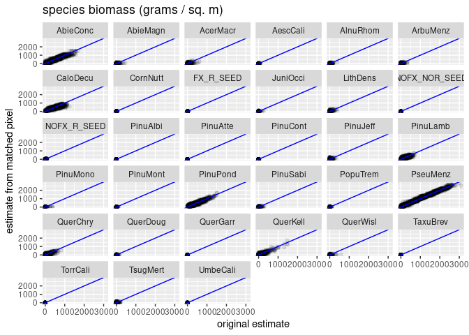
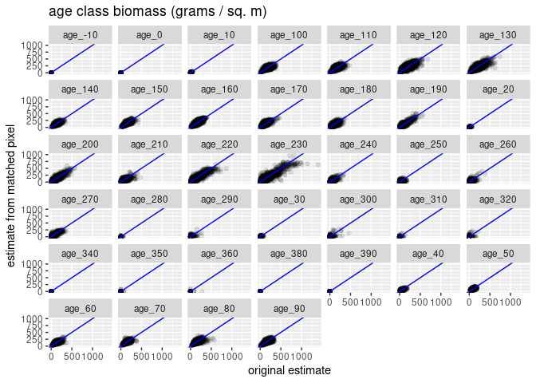

<!-- README.md is generated from README.Rmd. Please edit that file -->

# backcaster

The goal of backcaster is to recover treelists with pixel-level tallies
of stems by species and diameter class from Landis model data structures
(biomass by species and age class).

TODO outline basic process

## Installation

You can install the current version of backcaster from
[GitHub](https://github.com/) with:

``` r
# install.packages("remotes")
remotes::install_github("SilviaTerra/backcaster")
```

## Usage

To use backcaster you must have two sets of files stored on your
machine: - The 90 meter resolution treelist files from SilviaTerra’s
basemap data. These files are stored in a directory called `landis_dir`
in this example. - The corresponding Landis summary files with biomass
by species and age class for each pixel. These files are stored in a
directory called `treelist_dir` in this example.

The following example walks through the process of importing the raw
data, obtaining back-casted treelists, and some diagnostics.

``` r
library(backcaster)
library(dplyr)
#> 
#> Attaching package: 'dplyr'
#> The following objects are masked from 'package:stats':
#> 
#>     filter, lag
#> The following objects are masked from 'package:base':
#> 
#>     intersect, setdiff, setequal, union
library(ggplot2)
library(tibble)
```

There are 543 Landis summary files in the full dataset. The process
could be run with a subset of these files but we expect performance to
be best when the entire dataset is used.

``` r
all_landis_files <- list.files(
  landis_dir,
  full.names = TRUE
)

glimpse(all_landis_files)
#>  chr [1:2] "/home/henry/R/x86_64-pc-linux-gnu-library/4.0/backcaster/extdata/landis/10_10.csv.gz" ...
```

For this example we will hold one of the Landis summary files out of the
pixel matching lookup table so it can be used to evaluate the matching
performance. The rest of the files will be used to construct the lookup
table.

``` r
# save one for testing the matching procedure
test_landis_file <- file.path(
  landis_dir,
  "10_11.csv.gz"
)

# use the rest for building lookup table
training_landis_files <- setdiff(
  all_landis_files,
  test_landis_file
)
```

All of the Landis summary files that will be used to construct the
lookup table can be read in using `data.table::fread`. Alternative
methods of importing the files that result in a single large
`data.frame`-like object will also work.

``` r
landis_raw <- do.call(rbind, lapply(training_landis_files, data.table::fread))

glimpse(landis_raw)
#> Rows: 332,177
#> Columns: 5
#> $ pix_ctr_wkt                  <chr> "POINT(-1771455 -462015)", "POINT(-17714…
#> $ landis_species               <chr> "AcerMacr", "PinuPond", "QuerKell", "Ace…
#> $ age_class                    <int> 10, 30, 40, 20, 40, 30, 50, 60, 70, 80, …
#> $ aboveground_biomass_g_per_m2 <dbl> 0.769, 6.706, 24.308, 6.899, 13.051, 21.…
#> $ map_code                     <chr> "10_10_801", "10_10_801", "10_10_801", "…
```

The function `process_landis` is used re-shape the raw Landis data into
the format optimized for subsequent operations. This is a very wide
dataframe with observations of total biomass, biomass by species, and
biomass by age class for each pixel.

``` r
lookup <- process_landis(landis_raw)

glimpse(lookup)
#> Rows: 2,459
#> Columns: 74
#> $ map_code                     <chr> "10_10_1", "10_10_10", "10_10_100", "10_…
#> $ aboveground_biomass_g_per_m2 <dbl> 3249.2450, 3037.4800, 428.1404, 333.0496…
#> $ AbieConc                     <dbl> 355.435, 87.819, 41.522, 0.000, 146.537,…
#> $ AcerMacr                     <dbl> 0.537, 0.000, 0.086, 0.000, 0.000, 0.003…
#> $ AlnuRhom                     <dbl> 86.720, 0.000, 14.758, 0.000, 0.000, 0.0…
#> $ ArbuMenz                     <dbl> 113.157, 0.000, 0.374, 0.000, 0.000, 0.0…
#> $ CaloDecu                     <dbl> 278.388, 378.370, 17.241, 21.822, 95.899…
#> $ CornNutt                     <dbl> 0.045, 0.000, 0.050, 0.000, 0.000, 0.007…
#> $ LithDens                     <dbl> 225.798, 0.000, 0.053, 0.000, 0.000, 7.4…
#> $ PinuLamb                     <dbl> 243.522, 201.006, 0.326, 17.982, 45.452,…
#> $ PinuPond                     <dbl> 508.428, 576.176, 21.260, 167.172, 409.5…
#> $ PinuSabi                     <dbl> 0.332, 0.000, 0.547, 6.258, 0.210, 0.002…
#> $ PseuMenz                     <dbl> 1020.984, 1586.239, 24.494, 17.774, 291.…
#> $ QuerChry                     <dbl> 262.268, 143.483, 20.023, 0.742, 0.000, …
#> $ QuerKell                     <dbl> 128.199, 64.387, 1.837, 24.379, 31.229, …
#> $ QuerWisl                     <dbl> 25.370, 0.000, 14.215, 7.084, 0.000, 0.0…
#> $ UmbeCali                     <dbl> 0.062, 0.000, 0.035, 0.000, 0.000, 0.001…
#> $ AbieMagn                     <dbl> 0.000, 0.000, 26.832, 14.661, 0.000, 0.0…
#> $ AescCali                     <dbl> 0.000, 0.000, 0.007, 0.000, 0.000, 0.000…
#> $ FX_R_SEED                    <dbl> 0.000000, 0.000000, 12.076997, 18.405002…
#> $ JuniOcci                     <dbl> 0.000, 0.000, 0.160, 0.636, 0.000, 0.004…
#> $ NOFX_NOR_SEED                <dbl> 0.0000000, 0.0000000, 23.8428350, 7.7702…
#> $ NOFX_R_SEED                  <dbl> 0.000000, 0.000000, 70.494584, 27.992359…
#> $ PinuAlbi                     <dbl> 0.000, 0.000, 0.005, 0.000, 0.000, 0.000…
#> $ PinuAtte                     <dbl> 0.000, 0.000, 0.001, 0.000, 0.000, 0.000…
#> $ PinuJeff                     <dbl> 0.000, 0.000, 135.794, 0.000, 4.362, 0.0…
#> $ PinuMono                     <dbl> 0.000, 0.000, 0.004, 0.000, 0.000, 0.036…
#> $ PinuMont                     <dbl> 0.000, 0.000, 0.025, 0.372, 0.000, 0.000…
#> $ PopuTrem                     <dbl> 0.000, 0.000, 0.004, 0.000, 0.000, 0.003…
#> $ QuerDoug                     <dbl> 0.000, 0.000, 1.965, 0.000, 0.000, 0.001…
#> $ QuerGarr                     <dbl> 0.000, 0.000, 0.082, 0.000, 5.101, 0.000…
#> $ TaxuBrev                     <dbl> 0.000, 0.000, 0.001, 0.000, 0.000, 0.002…
#> $ TorrCali                     <dbl> 0.000, 0.000, 0.007, 0.000, 0.000, 0.000…
#> $ TsugMert                     <dbl> 0.000, 0.000, 0.018, 0.000, 0.000, 0.002…
#> $ PinuCont                     <dbl> 0.000, 0.000, 0.000, 0.000, 0.000, 0.000…
#> $ age_20                       <dbl> 0.53700, 0.00000, 30.38717, 29.23279, 0.…
#> $ age_30                       <dbl> 5.34200, 5.58000, 15.48336, 14.96776, 33…
#> $ age_40                       <dbl> 32.70800, 46.48000, 52.37134, 20.23100, …
#> $ age_50                       <dbl> 66.69200, 81.47600, 30.85900, 25.71000, …
#> $ age_60                       <dbl> 141.140, 121.797, 11.922, 26.809, 63.711…
#> $ age_70                       <dbl> 192.842, 143.902, 29.530, 29.375, 78.679…
#> $ age_80                       <dbl> 233.207, 197.249, 15.432, 26.826, 93.533…
#> $ age_90                       <dbl> 241.858, 184.249, 6.907, 19.141, 55.723,…
#> $ age_100                      <dbl> 184.137, 147.728, 14.501, 6.178, 40.856,…
#> $ age_110                      <dbl> 191.355, 256.005, 5.723, 0.137, 75.575, …
#> $ age_120                      <dbl> 364.583, 276.664, 3.106, 8.124, 98.242, …
#> $ age_130                      <dbl> 138.632, 147.072, 70.741, 4.363, 34.806,…
#> $ age_140                      <dbl> 226.445, 122.274, 9.214, 3.732, 48.032, …
#> $ age_150                      <dbl> 235.432, 223.833, 8.708, 5.048, 38.156, …
#> $ age_160                      <dbl> 251.997, 229.956, 47.494, 11.273, 61.955…
#> $ age_170                      <dbl> 165.187, 188.495, 10.507, 12.160, 19.667…
#> $ age_180                      <dbl> 110.924, 83.496, 2.719, 21.761, 65.033, …
#> $ age_190                      <dbl> 96.859, 120.703, 1.616, 2.791, 19.411, 2…
#> $ age_200                      <dbl> 74.688, 94.056, 2.797, 2.304, 55.444, 26…
#> $ age_210                      <dbl> 74.537, 36.784, 11.429, 12.160, 13.369, …
#> $ age_220                      <dbl> 59.115, 110.169, 2.871, 12.079, 18.955, …
#> $ age_230                      <dbl> 90.356, 111.818, 3.228, 3.329, 6.898, 31…
#> $ age_240                      <dbl> 10.638, 63.310, 0.402, 2.555, 30.393, 16…
#> $ age_250                      <dbl> 31.693, 1.890, 5.711, 1.848, 2.913, 16.3…
#> $ age_260                      <dbl> 4.751, 16.962, 0.492, 15.475, 2.245, 6.7…
#> $ age_270                      <dbl> 22.720, 25.297, 0.000, 0.000, 0.000, 11.…
#> $ age_300                      <dbl> 0.870, 0.235, 0.000, 0.000, 0.000, 0.000…
#> $ age_10                       <dbl> 0.000000, 0.000000, 33.989544, 15.440068…
#> $ age_0                        <dbl> 0.000, 0.000, 0.000, 0.000, 0.000, 0.003…
#> $ age_310                      <dbl> 0.000, 0.000, 0.000, 0.000, 0.000, 0.000…
#> $ age_280                      <dbl> 0.000, 0.000, 0.000, 0.000, 0.000, 0.000…
#> $ age_290                      <dbl> 0.000, 0.000, 0.000, 0.000, 0.000, 0.000…
#> $ age_350                      <dbl> 0.000, 0.000, 0.000, 0.000, 0.000, 0.000…
#> $ age_320                      <dbl> 0, 0, 0, 0, 0, 0, 0, 0, 0, 0, 0, 0, 0, 0…
#> $ age_340                      <dbl> 0, 0, 0, 0, 0, 0, 0, 0, 0, 0, 0, 0, 0, 0…
#> $ age_360                      <dbl> 0, 0, 0, 0, 0, 0, 0, 0, 0, 0, 0, 0, 0, 0…
#> $ `age_-10`                    <dbl> 0, 0, 0, 0, 0, 0, 0, 0, 0, 0, 0, 0, 0, 0…
#> $ age_380                      <dbl> 0, 0, 0, 0, 0, 0, 0, 0, 0, 0, 0, 0, 0, 0…
#> $ age_390                      <dbl> 0, 0, 0, 0, 0, 0, 0, 0, 0, 0, 0, 0, 0, 0…
```

Our goal in this example is to generate a treelist for a set of pixels
for which we do not already have treelists (e.g. model projection
results from Landis). The target pixels file can be processed and
imported in one fell swoop:

``` r
new_data <- process_landis(
  data.table::fread(test_landis_file)
)

glimpse(new_data)
#> Rows: 2,500
#> Columns: 74
#> $ map_code                     <chr> "10_11_1", "10_11_10", "10_11_100", "10_…
#> $ aboveground_biomass_g_per_m2 <dbl> 3091.838, 2773.577, 2964.190, 2113.569, …
#> $ AbieConc                     <dbl> 73.933, 436.066, 1178.398, 611.216, 462.…
#> $ AcerMacr                     <dbl> 31.067, 0.000, 0.000, 0.021, 66.706, 2.4…
#> $ AescCali                     <dbl> 0.255, 0.000, 0.000, 0.000, 0.000, 0.000…
#> $ AlnuRhom                     <dbl> 52.132, 0.000, 0.000, 0.024, 0.000, 0.00…
#> $ CaloDecu                     <dbl> 81.478, 662.608, 536.225, 291.330, 300.0…
#> $ CornNutt                     <dbl> 9.707, 0.000, 0.000, 5.684, 0.063, 0.000…
#> $ LithDens                     <dbl> 5.629, 0.000, 0.000, 0.001, 0.000, 0.000…
#> $ NOFX_R_SEED                  <dbl> 2.590086, 0.000000, 0.000000, 2.161740, …
#> $ PinuJeff                     <dbl> 23.029, 0.000, 0.000, 0.006, 0.000, 0.00…
#> $ PinuLamb                     <dbl> 169.555, 58.841, 94.580, 168.139, 284.14…
#> $ PinuPond                     <dbl> 139.514, 146.044, 249.807, 586.154, 284.…
#> $ PseuMenz                     <dbl> 1834.177, 1334.886, 902.714, 367.158, 15…
#> $ QuerChry                     <dbl> 428.201, 0.000, 0.000, 0.037, 0.000, 69.…
#> $ QuerKell                     <dbl> 223.631, 124.291, 2.466, 80.469, 173.571…
#> $ QuerWisl                     <dbl> 16.761, 0.000, 0.000, 0.011, 0.000, 0.00…
#> $ TorrCali                     <dbl> 0.179, 0.000, 0.000, 0.000, 0.000, 0.000…
#> $ ArbuMenz                     <dbl> 0.000, 9.486, 0.000, 1.090, 0.000, 0.531…
#> $ FX_R_SEED                    <dbl> 0.0000000, 1.3552730, 0.0000000, 0.00000…
#> $ JuniOcci                     <dbl> 0.000, 0.000, 0.000, 0.014, 0.000, 0.000…
#> $ PinuAlbi                     <dbl> 0.000, 0.000, 0.000, 0.003, 0.000, 0.000…
#> $ PinuAtte                     <dbl> 0.000, 0.000, 0.000, 0.003, 0.000, 0.000…
#> $ PinuMono                     <dbl> 0.000, 0.000, 0.000, 0.025, 0.000, 0.000…
#> $ PinuSabi                     <dbl> 0.000, 0.000, 0.000, 0.005, 0.000, 0.000…
#> $ PopuTrem                     <dbl> 0.000, 0.000, 0.000, 0.006, 0.000, 0.000…
#> $ QuerDoug                     <dbl> 0.000, 0.000, 0.000, 0.006, 0.000, 0.000…
#> $ QuerGarr                     <dbl> 0.000, 0.000, 0.000, 0.000, 0.000, 0.000…
#> $ TaxuBrev                     <dbl> 0.000, 0.000, 0.000, 0.000, 0.000, 0.000…
#> $ TsugMert                     <dbl> 0.000, 0.000, 0.000, 0.004, 0.000, 0.000…
#> $ UmbeCali                     <dbl> 0.000, 0.000, 0.000, 0.001, 0.000, 0.000…
#> $ AbieMagn                     <dbl> 0.000, 0.000, 0.000, 0.000, 0.000, 0.000…
#> $ PinuCont                     <dbl> 0.000, 0.000, 0.000, 0.000, 0.000, 0.000…
#> $ PinuMont                     <dbl> 0.000, 0.000, 0.000, 0.000, 0.000, 0.000…
#> $ NOFX_NOR_SEED                <dbl> 0.0000000, 0.0000000, 0.0000000, 0.00000…
#> $ age_10                       <dbl> 3.133086, 1.355273, 0.000000, 2.161740, …
#> $ age_20                       <dbl> 8.804000, 0.000000, 0.000000, 0.021000, …
#> $ age_30                       <dbl> 27.77300, 10.77000, 9.85200, 9.60100, 31…
#> $ age_40                       <dbl> 109.82200, 43.03000, 31.50300, 64.56900,…
#> $ age_50                       <dbl> 162.418, 90.181, 35.282, 50.375, 95.183,…
#> $ age_60                       <dbl> 185.696, 163.078, 64.475, 87.201, 218.62…
#> $ age_70                       <dbl> 203.558, 214.101, 65.489, 93.133, 150.58…
#> $ age_80                       <dbl> 273.028, 179.279, 74.413, 118.342, 158.7…
#> $ age_90                       <dbl> 256.566, 191.956, 125.140, 133.204, 200.…
#> $ age_100                      <dbl> 188.334, 202.590, 124.568, 128.228, 257.…
#> $ age_110                      <dbl> 226.980, 200.961, 211.420, 261.816, 168.…
#> $ age_120                      <dbl> 247.973, 306.873, 341.416, 95.344, 202.4…
#> $ age_130                      <dbl> 214.336, 97.721, 279.305, 148.515, 277.5…
#> $ age_140                      <dbl> 70.560, 113.775, 134.179, 147.995, 129.6…
#> $ age_150                      <dbl> 110.085, 159.199, 217.360, 128.047, 166.…
#> $ age_160                      <dbl> 192.629, 250.749, 321.620, 121.849, 189.…
#> $ age_170                      <dbl> 169.597, 148.122, 349.393, 48.172, 93.00…
#> $ age_180                      <dbl> 106.735, 85.929, 40.179, 73.916, 112.439…
#> $ age_190                      <dbl> 50.256, 59.523, 131.304, 64.086, 57.218,…
#> $ age_200                      <dbl> 44.899, 63.131, 144.275, 29.126, 74.799,…
#> $ age_210                      <dbl> 49.741, 13.195, 18.110, 35.511, 93.311, …
#> $ age_220                      <dbl> 28.502, 74.907, 54.101, 50.213, 130.087,…
#> $ age_230                      <dbl> 96.150, 51.767, 41.661, 8.946, 145.559, …
#> $ age_240                      <dbl> 9.651, 22.064, 8.787, 40.880, 29.159, 47…
#> $ age_250                      <dbl> 3.812, 1.718, 52.416, 96.857, 2.182, 1.0…
#> $ age_260                      <dbl> 30.303, 4.600, 52.525, 47.542, 17.439, 1…
#> $ age_270                      <dbl> 4.701, 23.003, 34.545, 26.803, 58.593, 6…
#> $ age_290                      <dbl> 1.134, 0.000, 0.000, 0.000, 0.000, 0.000…
#> $ age_300                      <dbl> 14.204, 0.000, 0.872, 0.740, 0.000, 0.78…
#> $ age_340                      <dbl> 0.458, 0.000, 0.000, 0.000, 0.000, 0.000…
#> $ age_0                        <dbl> 0.000, 0.000, 0.000, 0.006, 0.000, 0.000…
#> $ age_280                      <dbl> 0.000, 0.000, 0.000, 0.369, 0.000, 0.000…
#> $ age_310                      <dbl> 0.000, 0.000, 0.000, 0.000, 0.000, 0.000…
#> $ age_320                      <dbl> 0.000, 0.000, 0.000, 0.000, 0.000, 0.000…
#> $ age_350                      <dbl> 0.000, 0.000, 0.000, 0.000, 0.000, 0.000…
#> $ `age_-10`                    <dbl> 0, 0, 0, 0, 0, 0, 0, 0, 0, 0, 0, 0, 0, 0…
#> $ age_360                      <dbl> 0, 0, 0, 0, 0, 0, 0, 0, 0, 0, 0, 0, 0, 0…
#> $ age_380                      <dbl> 0, 0, 0, 0, 0, 0, 0, 0, 0, 0, 0, 0, 0, 0…
#> $ age_390                      <dbl> 0, 0, 0, 0, 0, 0, 0, 0, 0, 0, 0, 0, 0, 0…
```

The backcasting process can be executed with a call to the function
`backcast_landis_to_treelists`.

``` r
backcasted <- backcast_landis_to_treelists(
  new_data = new_data,
  lookup = lookup,
  n_clusters = 50,
  treelist_dir = treelist_dir
)
#> clustering lookup table on biomass x species
#> identifying nearest neighbor matches
#> collecting matching tree records
#> summarizing original vs matched Landis attributes
```






